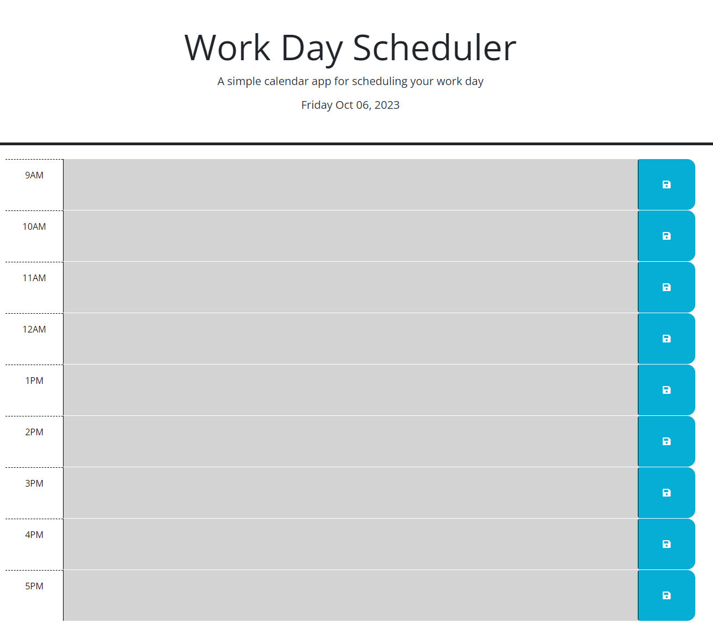
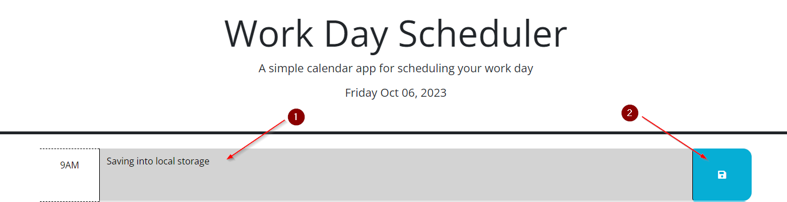
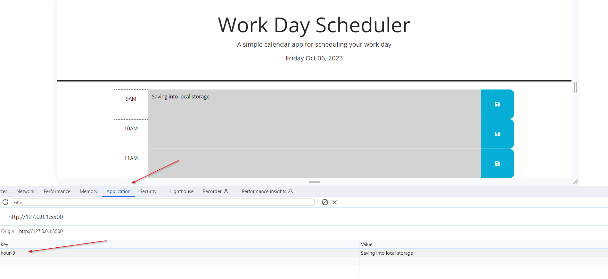

# WorkDayScheduler

Project was created to help schedule your day and plan for upcoming events. [Click here to go to site](https://baseduli.github.io/WorkDayScheduler/)

## Built with
Project is coded using html, CSS, JavaScript, Jquery, and includes other third party api 

## App usage
To use the app, simply open the app in your browser and start typing in the text area. Once you are done typing, click the save button to save your event. The app will save your event in local storage and will be displayed on the page.

Pictures of expected behavior

## License
See license [here](./LICENSE)

## Acknowledgement
[MDN website](https://developer.mozilla.org/en-US/)
[ChatGPT](https://chat.openai.com/)